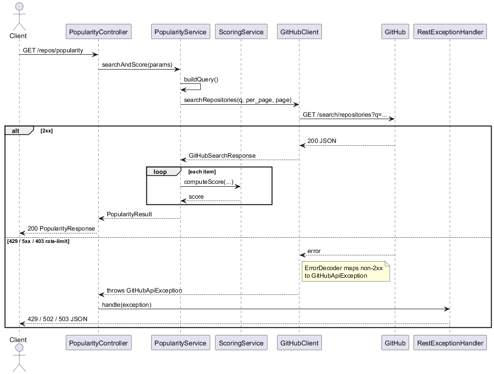
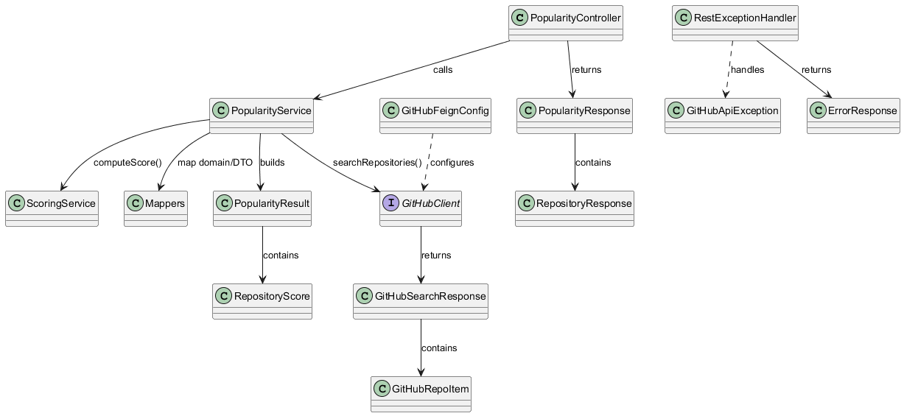
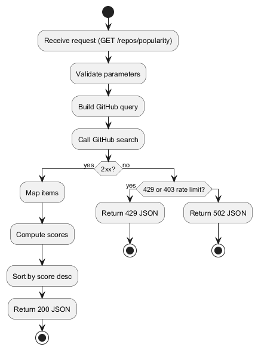

# GitHub Popularity Service (Java)

A small web service that helps you discover popular GitHub repositories. You send a simple query (optionally with language and date filters), and it calls GitHub Search, scores each repository by popularity, and returns a ranked list. It’s built with Spring Boot and OpenFeign.

Here’s the high‑level flow at a glance:



## Table of Contents
- Overview
- Scoring Model
- API
- OpenAPI
- Configuration
- Error Model
- Architecture
- Design Decisions
- Build & Run
- Testing
- Future Enhancements
- Known Limitations

## Overview
At its core, the service proxies the GitHub Repositories Search API and ranks results by a simple popularity formula (stars, forks, and freshness). There’s one HTTP endpoint under `/repos` to keep things straightforward.

## Scoring Model
```
score = 0.6 * stars + 0.3 * forks + 0.1 * recency
recency = 100 * (1 / (1 + days_since_update / 30))
```
Scores are rounded to two decimals.

Rationale
- Stars as primary signal (0.6): broad popularity and social proof.
- Forks as adoption signal (0.3): stronger commitment but rarer; secondary weight.
- Recency as freshness (0.1): favors active projects without overturning popularity.
- 30‑day half‑life style curve via `1/(1 + days/30)`: simple, monotonic decay.
- Only relative weights matter for ranking; tuning is straightforward if priorities change.

## OpenAPI
- Swagger UI: `/swagger-ui.html`
- OpenAPI JSON: `/v3/api-docs`

## Architecture
Here’s how the pieces fit together:

- Components
  - Controller (`PopularityController`): receives requests, validates inputs, hands off to the service.
  - Service (`PopularityService`): builds the GitHub search query, calls the client, computes scores, sorts, and maps results.
  - Scoring (`ScoringService`): calculates the weighted score with a gentle freshness boost.
  - Client (`GitHubClient`): OpenFeign interface to GitHub, configured by `GitHubFeignConfig` (headers, error decoder).
  - Mapping (`Mappers`): converts upstream and domain models into clean API DTOs; also rounds scores.
  - Errors (`RestExceptionHandler`): turns upstream errors into consistent JSON responses.
  - Models: controller DTOs (`PopularityResponse`, `RepositoryResponse`), domain (`PopularityResult`, `RepositoryScore`), upstream (`GitHubSearchResponse`, `GitHubRepoItem`).



- Request flow
  1) Controller receives the request and normalizes inputs.
  2) Service builds the GitHub search string and calls the Feign client.
  3) On success, items are mapped, scored, sorted (desc), and returned as DTOs.
  4) On error, the Feign error decoder throws `GitHubApiException`, and the advice returns 429/502.



## Design Decisions
- HTTP stack
  - Chosen: Spring MVC (blocking) for simplicity; sufficient for expected QPS.
  - Alternatives: WebFlux + WebClient for high concurrency or streaming/backpressure.
- GitHub client
  - Chosen: OpenFeign for concise typed client and easy header/error config.
  - Alternatives: Spring RestClient (blocking), WebClient (reactive).
- Error handling
  - Chosen: Map upstream 429→429; 403 with “rate limit”→429; 5xx→502 via one exception type.
  - Alternatives: propagate Feign errors; add retry/backoff; embed upstream body excerpts.
- Scoring
  - Chosen: simple interpretable weights with gentle freshness; round to 2 decimals.
  - Alternatives: tunable weights/half‑life; normalized/log‑scaled inputs; percentile scoring.

## Build & Run
Prerequisites: JDK 17+, Maven.

Build:
```
mvn -f java/pom.xml clean package
```

Run:
```
# Spring Boot plugin
mvn -f java/pom.xml spring-boot:run

# or executable JAR
java -jar java/target/github-popularity-0.1.0.jar
```

Optional environment:
```
set GITHUB_TOKEN=your_token_here
```

## API
All request and response details live in Swagger UI. If you just want to try it quickly, here’s a curl you can paste:

Quick test (curl):
```
curl -s "http://localhost:8080/repos/popularity?query=framework&language=Java&created_after=2024-01-01&per_page=10&page=1" | jq .
```

## Testing
Run all tests (unit + end‑to‑end via WireMock):
```
mvn -f java/pom.xml test
```

## Future Enhancements
- Caching: short‑TTL cache for identical queries (bounded size).
- Global ranking: fetch multiple pages and rank across them; or leverage GitHub sorting.
- Configurable scoring: weights and half‑life via properties.
- Rate‑limit visibility: record `X‑RateLimit-*`, back off to reset, expose metrics.
- Retries/backoff: Feign `Retryer` or Resilience4j Retry with jitter.
- Security: request throttling, API keys, and CORS policy where needed.

## Known Limitations
- No caching; repeated queries always hit GitHub.
- In‑page ranking only; not a global sort across all pages.
- Rate limits depend on token usage; unauthenticated calls are constrained.
- No built‑in retries; relies on timeouts and circuit breaker.

## Note on Development Assistance

During the development of this project, I utilized OpenAI's ChatGPT Codex to accelerate implementation.  
The overall design, including architecture decisions and UML diagrams (created with PlantUML), was prepared by me.  
I then guided Codex in generating parts of the code, which helped reduce implementation time while ensuring the final solution aligned with my intended design and requirements.  
