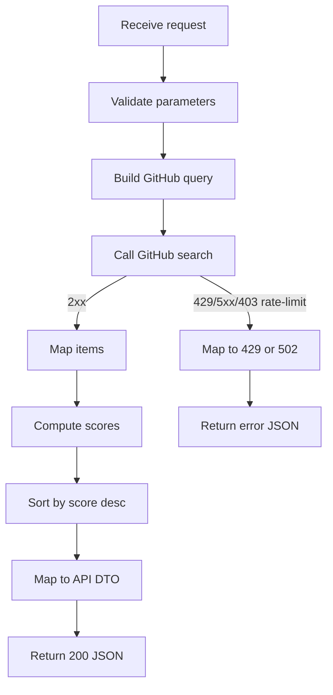

```mermaid
flowchart TD
    A[Receive request] --> B[Validate parameters]
    B --> C[Build GitHub query]
    C --> D[Call GitHub search]
    D -->|2xx| E[Map items]
    E --> F[Compute scores]
    F --> G[Sort by score desc]
    G --> H[Map to API DTO]
    H --> I[Return 200 JSON]
    D -->|429/5xx/403 rate-limit| X[Map to 429 or 502]
    X --> J[Return error JSON]
```

