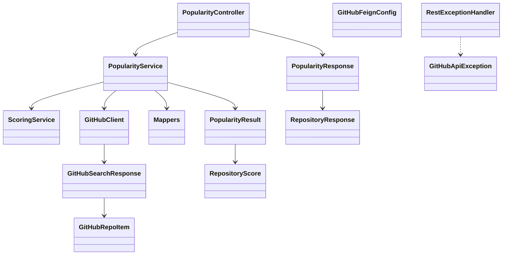

```mermaid
classDiagram
    class PopularityController
    class PopularityService
    class ScoringService
    class GitHubFeignConfig
    class RestExceptionHandler
    class GitHubApiException
    interface GitHubClient
    class Mappers

    class PopularityResult
    class RepositoryScore
    class PopularityResponse
    class RepositoryResponse
    class GitHubSearchResponse
    class GitHubRepoItem

    PopularityController --> PopularityService
    PopularityService --> ScoringService
    PopularityService --> GitHubClient
    PopularityService --> Mappers
    PopularityService --> PopularityResult
    PopularityResult --> RepositoryScore
    PopularityController --> PopularityResponse
    PopularityResponse --> RepositoryResponse
    GitHubClient --> GitHubSearchResponse
    GitHubSearchResponse --> GitHubRepoItem
    RestExceptionHandler ..> GitHubApiException
```

