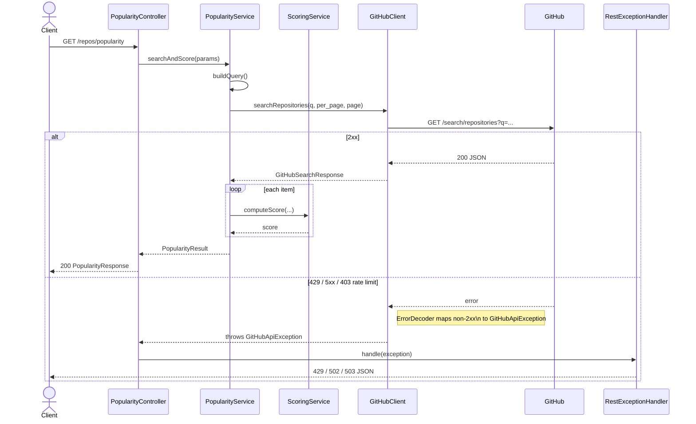

```mermaid
sequenceDiagram
    actor Client
    participant PopularityController
    participant PopularityService
    participant ScoringService
    participant GitHubClient
    participant GitHub as GitHub
    participant RestExceptionHandler

    Client->>PopularityController: GET /repos/popularity
    PopularityController->>PopularityService: searchAndScore(params)
    PopularityService->>PopularityService: buildQuery()
    PopularityService->>GitHubClient: searchRepositories(q, per_page, page)
    GitHubClient->>GitHub: GET /search/repositories?q=...
    alt 2xx
        GitHub-->>GitHubClient: 200 JSON
        GitHubClient-->>PopularityService: GitHubSearchResponse
        loop each item
            PopularityService->>ScoringService: computeScore(...)
            ScoringService-->>PopularityService: score
        end
        PopularityService-->>PopularityController: PopularityResult
        PopularityController-->>Client: 200 PopularityResponse
    else 429 / 5xx / 403 rate limit
        GitHub-->>GitHubClient: error
        note right of GitHubClient: ErrorDecoder maps non-2xx\n to GitHubApiException
        GitHubClient-->>PopularityController: throws GitHubApiException
        PopularityController->>RestExceptionHandler: handle(exception)
        RestExceptionHandler-->>Client: 429 / 502 / 503 JSON
    end
```

